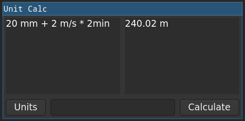

# Simple Unit aware calculator

This program uses gnu `units` program to evaluate expressions and show it.

You can calculate expressions, or give a unit you want your results to be.

The units button can be used to get a list of compatible units you could convert to.
